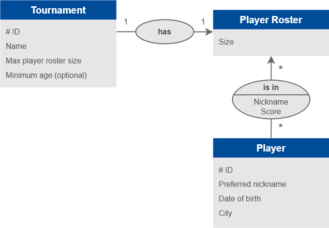

# Repository pattern example

 

1. [The use case](#the-use-case)
2. [The pattern](#the-pattern)

## The use case

## The pattern

Definition from [Definitions and Pattern Summaries, by Eric Evans](https://www.domainlanguage.com/ddd/reference/):

> 📖 For each type of aggregate that needs global access, create a service that can ***provide the illusion of an in-memory collection*** of all objects of that aggregate’s root type.
>
> Set up access through a well-known global interface.
> Provide methods to add and remove objects, which will encapsulate the actual insertion or removal of data in the data store.
> Provide methods that select objects based on criteria meaningful to domain experts.
> Return fully instantiated objects or collections of objects whose attribute values meet the criteria, thereby encapsulating the actual storage and query technology, or return proxies that give the illusion of fully instantiated aggregates in a lazy way.
>
> Provide repositories only for aggregate roots that actually need direct access.
>
> Keep application logic focused on the model, delegating all object storage and access to the repositories.
